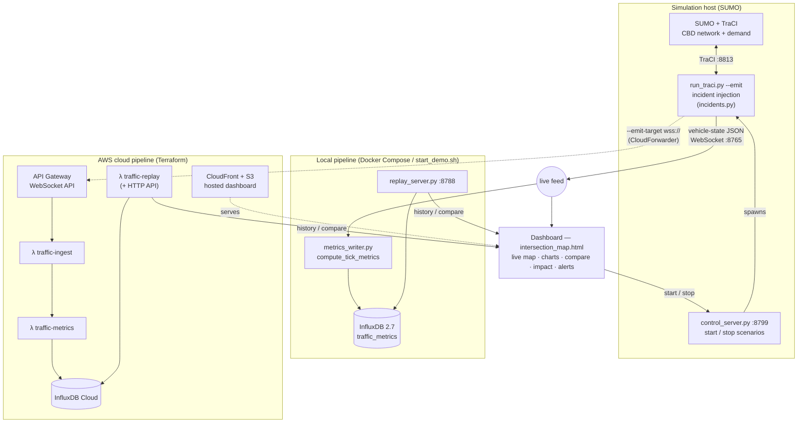

# Christchurch Smart-City Digital Twin

A **decision-support traffic digital twin** of the Christchurch CBD: a calibrated
SUMO micro-simulation that you can *perturb* — close a road, stage a crash, add an
event surge — and measure the impact against a real-data baseline, live in the
browser and backed by a cloud time-series pipeline.

[](https://github.com/kyawzinmyolwin/demo_smart_city_digital_twin/actions/workflows/ci.yml)

> COMP 693 Industry Project · Lincoln University, NZ. The SUMO network and demand are
> built from real Christchurch City Council + OpenStreetMap + Miovision data; the
> **incidents are synthetic what-ifs** injected via TraCI. "Real-time" means
> simulation-to-screen latency, not live road sensors.

---

## What it does

A digital twin is only interesting if you can ask *"what if?"*. This one lets a
non-technical user, from a web dashboard:

- **Watch live traffic** — vehicles coloured by speed on a Leaflet map, with live
  Chart.js panels (count, average speed, congestion index) and a sim clock.
- **Inject an incident** — click a road and close it live, then reopen it and watch
  the queue drain; or start a scenario (baseline / crash / roadworks) with one button.
- **Compare scenarios** — overlay a baseline run against an incident run (tagged by
  `scenario_id`) and read a quantified summary.
- **Read an impact report** — average-speed drop, congestion rise, stopped/peak
  vehicles between baseline and incident, each with a directional Δ.
- **Flag congestion** — segments slow for N consecutive ticks are listed and
  highlighted red on the map.

The counts → demand ETL pipeline is retained as the **real-data-calibrated baseline**
that incidents are compared against.

---

## Architecture



The **same producer** (`run_traci.py --emit`) feeds either pipeline: a local
InfluxDB for an offline demo, or AWS for the hosted deployment. The dashboard is one
HTML file pointed at whichever endpoints you give it via URL parameters
(`?ws=`, `?replay=`, `?control=`). See **[docs/ARCHITECTURE.md](docs/ARCHITECTURE.md)**
for the data-flow, local, and cloud deployment views plus a component reference.

---

## Quickstart

Three ways to run it, from easiest to most production-like.

### 1. Docker Compose — one command, only Docker needed

```bash
cp .env.example .env            # set INFLUXDB_PASSWORD (8+ chars) + INFLUXDB_TOKEN
docker compose up               # builds SUMO + app images, starts the whole stack
# open http://localhost:8000/scripts/intersection_map.html → click Connect
```

Brings up InfluxDB + the sim (SUMO + emitter) + metrics writer + replay API +
dashboard, all local. Full guide: **[DOCKER.md](DOCKER.md)**.

### 2. `start_demo.sh` — native host processes (VM already set up)

```bash
./start_demo.sh                 # InfluxDB + web + replay + control servers
# open the printed URL → click a Start button in the Scenario-control panel
./stop_demo.sh
```

For a machine that already has Python + SUMO. The sim starts from the dashboard
(control_server auto-starts the metrics writer too).

### 3. AWS cloud — hosted, Infrastructure-as-Code

```bash
cd infra
terraform init && terraform apply
```

API Gateway + Lambdas + InfluxDB Cloud + CloudFront/S3. See
**[infra/README.md](infra/README.md)** and **[running_guide.md](running_guide.md)**.

> Bare SUMO/Unity setup (no cloud) is in
> **[smart_city_digital_twin/README.md](smart_city_digital_twin/README.md)**.

---

## Tech stack

| Layer | Choice |
|---|---|
| Simulation | Eclipse SUMO + TraCI (Python) |
| Producer / emitter | `asyncio` + `websockets` |
| Time-series store | InfluxDB (2.7 local / InfluxDB Cloud) |
| Cloud pipeline | AWS API Gateway (WebSocket) + Lambda + S3 + CloudFront + Secrets Manager |
| IaC | Terraform |
| Dashboard | Leaflet + Chart.js (single static HTML) |
| Local orchestration | Docker Compose |
| CI | GitHub Actions |

Key decisions and their rationale live in **[CLAUDE.md](CLAUDE.md)**.

---

## Testing & CI

```bash
cd smart_city_digital_twin/2D_simulation
pip install -r requirements-dev.txt
python -m pytest scripts/tests scripts/etl/tests -q      # 86 tests
```

Tests are **pure** — fake `traci` / `Popen`, AWS mocked with `moto`, dashboard JS
checked with `node --check`; no SUMO, cloud, or network required. GitHub Actions
(`.github/workflows/ci.yml`) runs them on every push/PR across Python 3.11 + 3.12;
`deploy-dashboard.yml` publishes the map to GitHub Pages.

---

## Repository layout

```
demo_smart_city_digital_twin/
├── README.md                  ← you are here
├── docker-compose.yml         ← one-command local stack
├── docker/                    ← sim (SUMO) + app Dockerfiles
├── start_demo.sh stop_demo.sh ← native local launcher
├── docs/ARCHITECTURE.md       ← diagrams + component reference
├── infra/                     ← Terraform (AWS) + Lambda functions
├── smart_city_digital_twin/
│   ├── README.md              ← SUMO / Unity simulation setup
│   └── 2D_simulation/
│       ├── Christchurch_Central_City_main_streets.sumocfg
│       ├── data/output/       ← network (.net.xml), demand (.rou.xml), geo CSV
│       └── scripts/           ← run_traci.py, emitter.py, incidents.py,
│                                 metrics*.py, replay_server.py, control_server.py,
│                                 intersection_map.html, etl/, tests/
└── Unity_fundamental/         ← unrelated tutorial, ignore
```

---

## Documentation

| Doc | What |
|---|---|
| [DOCKER.md](DOCKER.md) | One-command local stack |
| [docs/ARCHITECTURE.md](docs/ARCHITECTURE.md) | Diagrams + component reference |
| [infra/README.md](infra/README.md) | AWS/Terraform cloud pipeline |
| [running_guide.md](running_guide.md) | End-to-end run guide (local + cloud) |
| [METRICS_REPLAY.md](METRICS_REPLAY.md) | Metrics / replay / InfluxDB deep dive |
| [COMMANDS.md](COMMANDS.md) | Command cheat sheet (per terminal) |
| [CHECKLIST.md](CHECKLIST.md) | Project status at a glance |
| [smart_city_digital_twin/README.md](smart_city_digital_twin/README.md) | SUMO + Unity setup |

---

## Data sources

- **Christchurch City Council** — intersection traffic counts (Miovision surveys) and
  road-intersection geometry (ArcGIS OpenData); download-only, used as one-time
  calibration/demand inputs, not live feeds.
- **OpenStreetMap** — base road network for the main-streets model.
- **Eclipse SUMO** — the real-time data source (every simulation step).

---

*COMP 693 Industry Project · Lincoln University, NZ*
