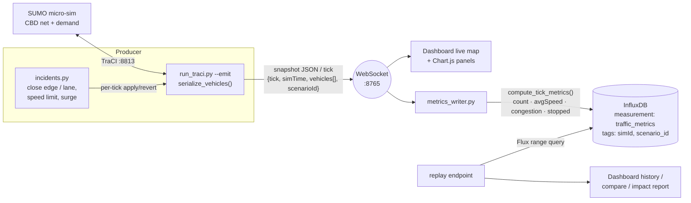
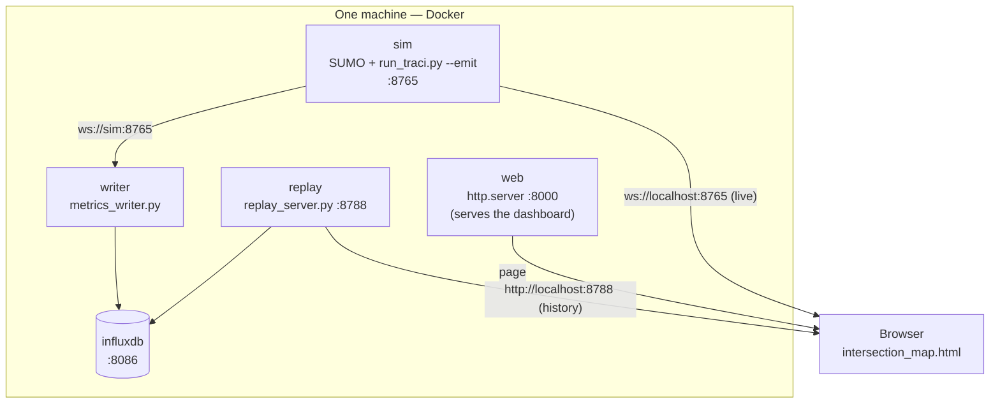
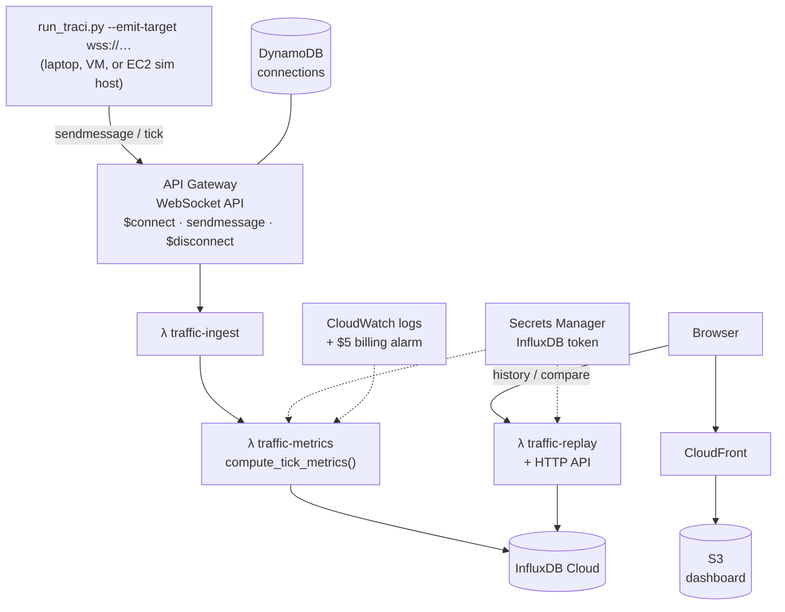

# Architecture

The Christchurch decision-support twin has one **producer** (SUMO + the TraCI
emitter) feeding one of two interchangeable **pipelines** (local or AWS), and one
**dashboard** that points at whichever pipeline's endpoints you give it. This doc
shows the data flow, the two deployment topologies, and a component reference.

> Diagrams are [Mermaid](https://mermaid.js.org/) — GitHub renders them inline. To
> export an image for a report/slide, paste a block into <https://mermaid.live> and
> download SVG/PNG.

---

## 1. Data flow (end to end)



The emitter schema is the contract between producer and everything downstream:

```json
{ "tick": 1720123456789, "simId": "christchurch-cbd-001", "simTime": 23460.1,
  "scenarioId": "crash_arterial", "vehicleCount": 214,
  "vehicles": [ { "id": "veh_001", "lat": -43.5321, "lng": 172.6362,
                  "speed": 13.4, "lane": "edge_42_0", "accel": 0.2, "type": "car" } ] }
```

`compute_tick_metrics()` is a **pure function** (unit-tested without SUMO) and is the
*same code* on both pipelines — a local module for `metrics_writer.py` and copied
into the `traffic-metrics` Lambda, kept in sync.

---

## 2. Local deployment (Docker Compose / `start_demo.sh`)

Everything on one machine. `docker compose up` runs each box as a container; the
browser reaches published host ports.



`start_demo.sh` runs the same services as **host processes** instead of containers,
and adds `control_server.py` (:8799) so scenarios start from the dashboard. See
[DOCKER.md](../DOCKER.md) and the start/stop scripts.

---

## 3. Cloud deployment (AWS, Terraform)

The producer dials out to API Gateway; metrics land in InfluxDB Cloud; the dashboard
is served from CloudFront/S3 and reads history via an HTTP-fronted replay Lambda.



Region `ap-southeast-2`. Idle cost ≈ the Secrets Manager secret (~$0.40/mo); a $5
billing alarm guards the rest. An optional on-demand EC2 **sim host**
(`infra/sim_host.tf`, gated off by default) runs the producer in AWS so no laptop is
needed. Details in [infra/README.md](../infra/README.md).

---

## 4. Component reference

| Component | File | Role |
|---|---|---|
| TraCI control loop + emitter | `scripts/run_traci.py` | Drives SUMO; emits per-tick snapshots over WebSocket and/or to the cloud (`--emit`, `--emit-target`); injects incidents (`--close-edge`, `--incident-file`, `--scenario-id`). |
| Serialiser + WS server | `scripts/emitter.py` | `serialize_vehicles()`, broadcaster, inbound control inbox (live close/reopen). |
| Incident model | `scripts/incidents.py` | `IncidentController` — close edge/lane, speed limit, demand surge; apply + revert. |
| Metrics (pure) | `scripts/metrics.py` | `compute_tick_metrics()` — count, avg speed, congestion index, stopped/moving. |
| Local writer | `scripts/metrics_writer.py` | WS feed → metrics → InfluxDB (tags `simId`, `scenario_id`). |
| Local read API | `scripts/replay_server.py` | Flux range queries → JSON for the dashboard (CORS; `scenario` filter). |
| Scenario control | `scripts/control_server.py` | HTTP server that starts/stops named-preset runs (and the writer) from the browser. |
| Dashboard | `scripts/intersection_map.html` | Leaflet live map, Chart.js panels, compare view, impact report, congestion alerts, click-to-inject. |
| Cloud Lambdas | `infra/functions/traffic_{ingest,metrics,replay}/` | Ingest ticks → aggregate (same `metrics.py`) → store; serve replays. |
| ETL (baseline) | `scripts/etl/`, `scripts/scenario_bridge.py` | Council counts → calibrated demand/baseline; S3 + query Lambdas. |
| IaC | `infra/*.tf` | API Gateway, Lambdas + IAM, DynamoDB, S3/CloudFront, Secrets Manager, CloudWatch. |

## Ports

| Port | Service |
|---|---|
| 8813 | SUMO TraCI |
| 8765 | Emitter WebSocket (live feed) |
| 8086 | InfluxDB (local) |
| 8788 | replay_server (local read API) |
| 8799 | control_server (start/stop scenarios) |
| 8000 | Dashboard web server |
