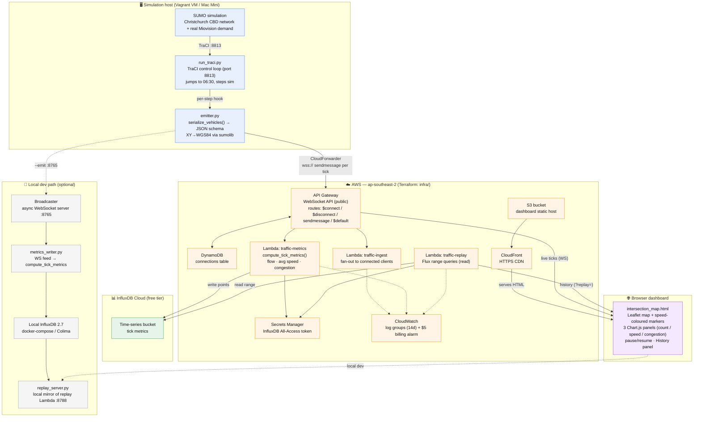
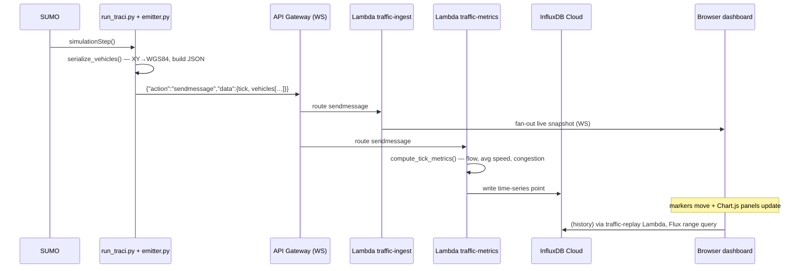

# Architecture — Smart City Digital Twin

A Christchurch CBD traffic simulation (SUMO) extended with a real-time cloud data
pipeline and a live browser dashboard. The simulation is the data source; every
step produces fresh per-vehicle state, which is streamed to the cloud, aggregated
into metrics, stored as time-series, and visualised live and historically.

**Stack:** SUMO/TraCI · Python (asyncio + websockets) · AWS (API Gateway WebSocket,
Lambda, DynamoDB, S3, CloudFront, Secrets Manager, CloudWatch) · InfluxDB Cloud ·
Leaflet + Chart.js · Terraform · GitHub Actions.
**Region:** `ap-southeast-2` (billing alarm in `us-east-1`).

---

## System overview

---

## Real-time data flow (per simulation tick)

---

## Layers

| Layer | Components | Notes |
|---|---|---|
| **Simulation** | SUMO, `run_traci.py`, `emitter.py` | TraCI on `:8813`. `serialize_vehicles()` converts SUMO XY → WGS84 (`sumolib`). `CloudForwarder` dials API Gateway; resilient (reconnects, never crashes the sim). Throttle with `--emit-interval`. |
| **Ingress** | API Gateway WebSocket API | Public endpoint. Routes `$connect`/`$disconnect`/`sendmessage`/`$default`. Connection IDs tracked in DynamoDB. |
| **Compute** | 3 Lambdas | `traffic-ingest` (fan-out), `traffic-metrics` (`compute_tick_metrics`, kept in sync with `scripts/metrics.py`), `traffic-replay` (read/range). |
| **Storage** | InfluxDB Cloud, DynamoDB, S3, Secrets Manager | Time-series → InfluxDB Cloud (not local Docker). Token in Secrets Manager, never hardcoded. Dashboard on S3. |
| **Delivery** | CloudFront | HTTPS CDN in front of the S3-hosted dashboard. |
| **Presentation** | `intersection_map.html` | Leaflet + speed-coloured markers + 3 Chart.js panels + pause/resume + History panel (`?replay=<url>`). |
| **Observability** | CloudWatch | One log group per Lambda (14-day retention) + $5 billing alarm (`us-east-1`). |
| **IaC / CI** | Terraform (`infra/`), GitHub Actions | S3 + DynamoDB backend for state. |

---

## Local development path

For offline work the emitter's `--emit` WebSocket server (`:8765`) feeds
`metrics_writer.py` → **local InfluxDB** (Docker Compose / Colima), and
`replay_server.py` (`:8788`) mirrors the replay Lambda so the dashboard's history
panel works without touching AWS. The browser points at it with `?replay=http://localhost:8788/metrics`.

## Known open items

- **Replay public-URL access (403):** the replay Lambda Function URL denies anonymous
  access on this account; front it with API Gateway (or IAM-signed requests) so the
  deployed dashboard's history charts work.
- **Dashboard upload:** push `intersection_map.html` to S3 + CloudFront invalidation so
  the hosted copy matches the current version.
